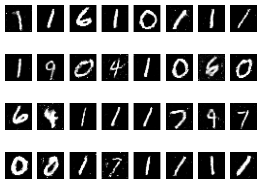

# GANS
In this repository, i will be implementing GAN algorithms from scratch.

# GANs that I have implemented
- Simple GAN
- DCGAN

# Libraries that I used
- PyTorch
- Matplotlib

# Generated Images

